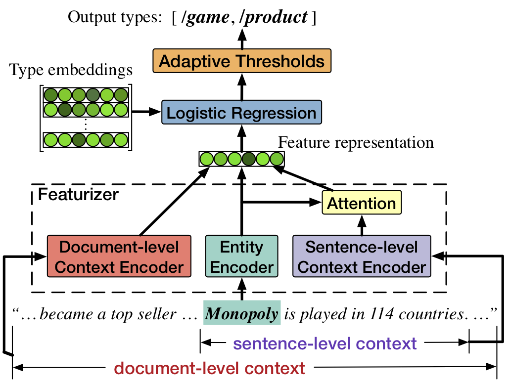

## Fine-grained Entity Typing through Increased Discourse Context and Adaptive Classification Thresholds

Source code and data for *StarSem*'18 paper **[Fine-grained Entity Typing through Increased Discourse Context and Adaptive Classification Thresholds](#)**. 

<p align="center">

</p>

## Citation
The source code and data in this repository aims at facilitating the study of fine-grained entity typing. If you use the code/data, please cite it as follows:

```
@InProceedings{zhang-EtAl:2018:starSEM,
  author    = {Zhang, Sheng  and  Duh, Kevin  and  {Van Durme}, Benjamin},
  title     = {{Fine-grained Entity Typing through Increased Discourse Context and Adaptive Classification Thresholds}},
  booktitle = {Proceedings of the 7th Joint Conference on Lexical and Computational Semantics (*SEM 2018)},
  month     = {June},
  year      = {2018}
}
```


## Benchmark Performance
### 1. OntoNotes ([Gillick et al., 2014](https://arxiv.org/pdf/1412.1820.pdf)) 
Approach | Strict F1 | Macro F1 | Micro F1 
-------|-----------|--------|----
Our Approach | **55.52** | **73.33** | **67.61** 
&nbsp;&nbsp;&nbsp;&nbsp;w/o Adaptive thresholds | 53.49 | 73.11 | 66.78 
&nbsp;&nbsp;&nbsp;&nbsp;w/o Document-level contexts | 53.17 | 72.14 | 66.51 

### 2. Wiki ([Ling and Weld, 2012](http://xiaoling.github.io/pubs/ling-aaai12.pdf)) 
Approach | Strict F1 | Macro F1 | Micro F1 
-------|-----------|--------|----
Our Approach | **60.23** | **78.67** | **75.52** 
&nbsp;&nbsp;&nbsp;&nbsp;w/o Adaptive thresholds | 60.05 | 78.50 | 75.39 

### 3. BBN ([Weischedel and Brunstein, 2005](https://catalog.ldc.upenn.edu/ldc2005t33)) 
Approach | Strict F1 | Macro F1 | Micro F1 
-------|-----------|--------|----
Our Approach | **60.87** | **77.75** | **76.94** 
&nbsp;&nbsp;&nbsp;&nbsp;w/o Adaptive thresholds | 58.47 | 75.84 | 75.03 
&nbsp;&nbsp;&nbsp;&nbsp;w/o Document-level contexts | 58.12 | 75.65 | 75.11 


## Prerequisites

* Python 2.7
* PyTorch 0.2.0 (w/ CUDA support)
* Numpy
* tqdm


## Running
Once getting the prerequisites, you can run the whole process very easily. Take the OntoNotes corpus for example,

### Step 1: Download the data
```bash
./scripts/ontonotes.sh get_data
```

### Step 2: Preprocess the data
```bash
./scripts/ontonotes.sh preprocess
```

### Step 3: Train the model
```bash
./scripts/ontonotes.sh train
```
### Step 4: Tune the threshold
```bash
./scripts/ontonotes.sh adaptive-thres
```

### Step 5: Do inference
```bash
./scripts/ontonotes.sh inference
```

## Acknowledgements
The datasets (Wiki and OntoNotes) are copies from Sonse Shimaoka's [repository](https://github.com/shimaokasonse/NFGEC). 

## License

[MIT](LICENSE)
